# Physics 2212 — Electricity & Magnetism: Comprehensive Notes (Weeks 1–5)

---

## 1. Mathematical Toolkit: Vectors and the Binomial Approximation

Everything in E&M is a vector field or a scalar field, so before touching a single Coulomb force you need fluency with vectors. This section is the toolbox; every later derivation reaches back into it.

### 1.1 Vectors: magnitude and direction

A **vector** is any quantity defined by a magnitude *and* a direction (contrast a **scalar**, which is just a number: temperature, mass, charge).

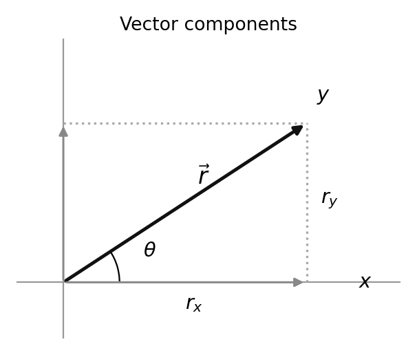

For a position vector $\vec r$ making angle $\theta$ with the x-axis:

$$
r = |\vec r| = \sqrt{r_x^2+r_y^2}, \qquad \hat r = \frac{\vec r}{r}, \qquad \vec r = r_x\hat x + r_y\hat y = \langle r_x, r_y, 0\rangle
$$

- **Magnitude** $r$ is always $\ge 0$; it's the length of the arrow.
- **Components** are scalars: $r_x = r\cos\theta$, $r_y = r\sin\theta$ (if you instead measure the angle $\phi$ from the y-axis, the sine and cosine swap: $r_x=r\sin\phi$, $r_y=r\cos\phi$ — always re-derive from a picture, never memorize blindly).
- **Unit vector** $\hat r$ always has magnitude exactly 1: $|\hat r| = \vec r/r = r/r = 1$. It carries *only* direction information. You will use $\hat r$ constantly — it is what lets you turn "how far" into "which way."

> [!tip] Why unit vectors matter so much in this course
> Coulomb's law, the electric field, and the dipole field are all "(some scalar magnitude) $\times\ \hat r$." Separating magnitude from direction like this is the single biggest simplification in the whole course — internalize it now.

### 1.2 Vector addition

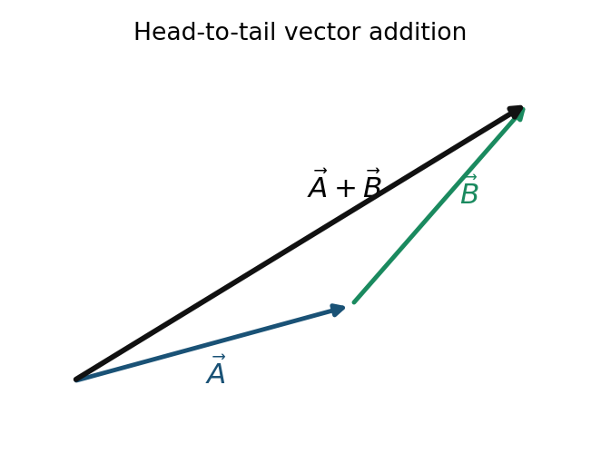

Vectors add component-by-component:

$$
\vec A+\vec B=(A_x+B_x)\hat x+(A_y+B_y)\hat y
$$

Geometrically, this is the **head-to-tail rule**: slide $\vec B$'s tail to $\vec A$'s head; the sum runs from $\vec A$'s tail to $\vec B$'s head. You'll use this picture constantly to *guess* the direction of a net force or field before grinding through algebra.

### 1.3 The dot ("scalar") product

$$
\vec A \cdot \vec B = AB\cos\theta = A_xB_x + A_yB_y + A_zB_z
$$

The result is a **scalar** (a plain number), not a vector. Two useful special cases: $\vec A\cdot\vec B=0$ when the vectors are perpendicular, and $\vec A \cdot \hat r$ picks out the component of $\vec A$ along $\hat r$. This shows up constantly when computing $\vec E\cdot d\vec r$ for the electric potential (Section 10).

The cross ("vector") product of two vectors is itself a vector — you'll meet it later in the course (magnetism); it doesn't appear in Weeks 1–5.

### 1.4 The binomial approximation

This is the single most useful piece of math in the entire course. For any real exponent $n$ and any small number $\epsilon$ (meaning $|\epsilon|\ll 1$):

$$
(1+\epsilon)^n \approx 1+n\epsilon
$$

**Where it comes from.** The full (Taylor/binomial) series is $(1+\epsilon)^n = 1+n\epsilon+\frac{n(n-1)}{2!}\epsilon^2+\cdots$. Each successive term is smaller than the last by an extra factor of $\epsilon$, so if $\epsilon$ is small, truncating after the first-order term throws away something tiny. It works for *any* $n$ — positive, negative, or fractional — not just positive integers.

**Step-by-step recipe** (memorize this procedure, not just the formula):

1. Identify a large quantity $d$ and a small quantity $s$ with $d\gg s$ in your expression.
2. Algebraically force the expression into the form $(\text{big})^n(1+\epsilon)^n$, by factoring the large quantity out of every term inside a sum or difference, so that what's left over is a small ratio $\epsilon=\pm s/d$.
3. Replace $(1+\epsilon)^n$ with $1+n\epsilon$.
4. Distribute and simplify. Often the zeroth-order term ($1$) reproduces something you already knew, and the *interesting new physics* is hiding in the $n\epsilon$ correction.

> [!example] Worked example: the on-axis dipole field
> Starting from the exact two-charge sum (Section 5) and factoring $r$ out of each denominator: $(r\mp s/2)^{-2} = r^{-2}(1\mp s/2r)^{-2}$. Apply the rule with $n=-2$, $\epsilon=\mp s/(2r)$:
> $$
> \left(1-\frac{s}{2r}\right)^{-2} \approx 1+2\cdot\frac{s}{2r} = 1+\frac{s}{r}, \qquad \left(1+\frac{s}{2r}\right)^{-2} \approx 1-2\cdot\frac{s}{2r} = 1-\frac{s}{r}
> $$
> $$
> \vec E_\parallel(\vec r) = \frac{kq}{r^2}\left[\left(1+\frac{s}{r}\right)-\left(1-\frac{s}{r}\right)\right]\hat r = \frac{kq}{r^2}\cdot\frac{2s}{r}\,\hat r = k\frac{2qs}{r^3}\hat r = k\frac{2\vec p}{r^3}
> $$
> This matches the exact-limit result from Section 5 — the binomial trick is just a faster, more systematic route than combining fractions by hand.

**Everywhere else this tool appears in these notes:** the point-charge limit of the disk's potential (Section 12.2) is the $n=1/2$ case, applied to $\sqrt{z^2+R^2}=|z|(1+R^2/z^2)^{1/2}\approx|z|\left(1+\tfrac12\tfrac{R^2}{z^2}\right)$. Any "far field" ($r\gg$ object size) or "close-up" limit in this course is this tool at work under the hood.

---

## 2. Electric Charge

### 2.1 What charge is

The ancient Greeks discovered that rubbing amber with fur made it attract feathers and straw. Benjamin Franklin later invented the algebraic convention ($\pm$) that quantifies the strength of this force: **electric charge**.

> [!important] Fundamental facts about charge
> - Charge is an **intrinsic, indestructible property** of the elementary constituents of matter — not something "made of" anything more basic.
> - The smallest magnitude of charge is $e = 1.602\times10^{-19}$ C (often rounded to $1.6\times10^{-19}$ C).
> - proton: $+e$ · electron: $-e$ · neutron: $0$.
> - A sample of matter with $N_p$ protons and $N_e$ electrons has net charge $q = e(N_p - N_e)$.

### 2.2 Conservation of charge

Charge is **conserved**: it is never created or destroyed in any ordinary process, because it is an intrinsic property of electrons and protons, and those particles themselves are not created or destroyed in ordinary (non-nuclear) processes.

**Full disclosure:** quantum mechanics *does* permit creation of an electron and a proton together — for example, radioactive neutron decay $n \to p + e + \bar\nu$ — but notice that the *total* charge before ($0$, a neutral neutron) and after ($+e-e=0$) is unchanged. Charge conservation survives even this exception.

### 2.3 Charge can be *moved* extremely easily

The electron-to-proton mass ratio is $m_e/m_p \approx 5\times10^{-4}$, meaning electrons are almost 2000× lighter than protons. This makes electrons vastly easier to strip off or add to atoms than protons — and it's the single fact underlying **static electricity, polarization, and electrical conduction**, the three phenomena that dominate the next few sections. (J.J. Thomson's 1897 discovery of the electron — for which he won the 1906 Nobel Prize — is what made this whole picture possible.)

---

## 3. Coulomb's Law

Charles-Augustin de Coulomb (1736–1806) experimentally quantified the force between two charged objects.

### 3.1 Statement of the law

**Coulomb's Law:** the force that a point charge* $q_1$ located at $\vec r_1$ exerts on a point charge $q_2$ located at $\vec r_2$:

$$
\vec F_{21} = k\,q_1 q_2\, \frac{\vec r_2-\vec r_1}{|\vec r_2-\vec r_1|^3} = -\vec F_{12}
$$

with Coulomb's constant

$$
k = \frac{1}{4\pi\epsilon_0} = 9\times10^9\ \text{N·m}^2\text{/C}^2
$$

$\epsilon_0$ (the *permittivity of free space*) is a fundamental physical constant of Nature, playing a role analogous to Newton's gravitational constant $G$.

*\*A point charge is a charged object so small that its physical size plays no role in the physics — an idealization, like a "point mass" in mechanics.*

### 3.2 Magnitude: an inverse-square law

Taking the magnitude of both sides, with $R \equiv |\vec r_2-\vec r_1|$ the separation distance:

$$
|\vec F_{21}| = |\vec F_{12}| = \frac{1}{4\pi\epsilon_0}\frac{|q_1q_2|}{R^2} = \frac{k|q_1q_2|}{R^2}
$$

This is an **inverse-square law** — structurally identical to Newton's law of gravitation, $F=Gm_1m_2/R^2$. That resemblance is not a coincidence you need to explain; it's a pattern worth noticing because your mechanics intuition (e.g. about orbits, potential wells) often carries over directly.

### 3.3 Direction: attraction and repulsion

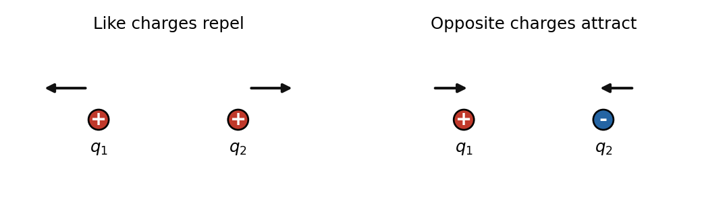

- **Like charges repel.**
- **Opposite charges attract.**

Coulomb's law automatically satisfies **Newton's third law** ($\vec F_{21}=-\vec F_{12}$), because the force depends only on the *separation* $\vec r_2-\vec r_1$ between the two charges — never on where you happened to put your coordinate origin. This is worth pausing on: if the physics depended on the origin, the theory would be broken, since the origin is a bookkeeping choice, not a physical feature of the world.

### 3.4 Superposition: forces add as vectors

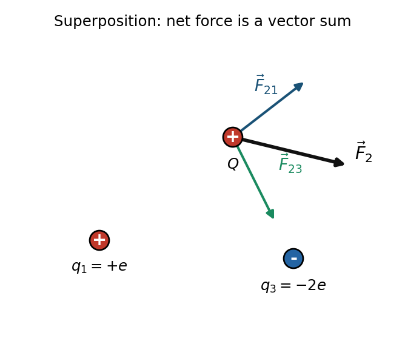

When several charges $1,2,\ldots,N$ simultaneously act on a charge $Q$, the **net force is the vector sum** of the individual Coulomb forces:

$$
\vec F_Q = \vec F_{Q1}+\vec F_{Q2}+\cdots+\vec F_{QN}
$$

> [!warning] The single most common beginner mistake
> This is **vector** addition, never scalar addition. You cannot add magnitudes and then "figure out" a direction afterward — you must add the $x$-components together and the $y$-components together separately (or draw the head-to-tail diagram), *then* take the magnitude of the result if you need it. A force of 5 N right plus a force of 5 N left is **0**, not 10 N.

**Worked example.** Three charges: $q_1=+e$, a test charge $Q$ sits between them, and $q_3=-2e$. The force on $Q$ is $\vec F_2 = \vec F_{21}+\vec F_{23}$ — you compute each Coulomb force separately using the formula above (each pointing along the line connecting the relevant pair of charges, repulsive from $q_1$ since $Q$ is presumably positive, attractive toward $q_3$ since it's negative), then add the two vectors head-to-tail to get the true net force direction — which in general points *nowhere near* either individual contribution.

---

## 4. The Electric Field

### 4.1 Faraday's idea: separating the "victim" from the "source"

Michael Faraday came from a poor English family, was schooled only through age 12, and apprenticed to a bookbinder — yet by thinking hard about his own experiments (he knew almost no formal mathematics) he introduced one of the most powerful concepts in all of physics: the **field**.

A field assigns a value to *every point in space*. A **scalar field** like temperature $T(\vec r)$ assigns a number to each point; a **vector field** like wind velocity $\vec W(\vec r)$ assigns a magnitude and direction to each point.

Faraday's insight, applied to electricity: the total Coulomb force on a charge $Q$ sitting at a point $P$ is

$$
\vec F_Q = Q\,\vec E(P)
$$

where $\vec E(P)$ is the **electric field** at $P$ — produced by *every other* charge in the world — and it exists at $P$ whether or not $Q$ is actually sitting there to feel it. The field is a property of *space itself*, sourced by charges; a test charge dropped into that space merely reveals the field that was already there.

### 4.2 Field of a point charge

Rewrite Coulomb's law by simply factoring out the "victim" charge $Q$:

$$
\vec F_{Qq} = kQq\,\frac{\vec r_Q-\vec r_q}{|\vec r_Q-\vec r_q|^3} = Q\underbrace{\left[kq\,\frac{\vec r_Q-\vec r_q}{|\vec r_Q-\vec r_q|^3}\right]}_{\vec E_q(\vec r_Q-\vec r_q)}
$$

so that, for a charge $q$ sitting at the origin, the field it produces at position $\vec r$ is

$$
\vec E(\vec r) = \frac{kq}{r^2}\hat r
$$

### 4.3 Two equivalent pictures of a field

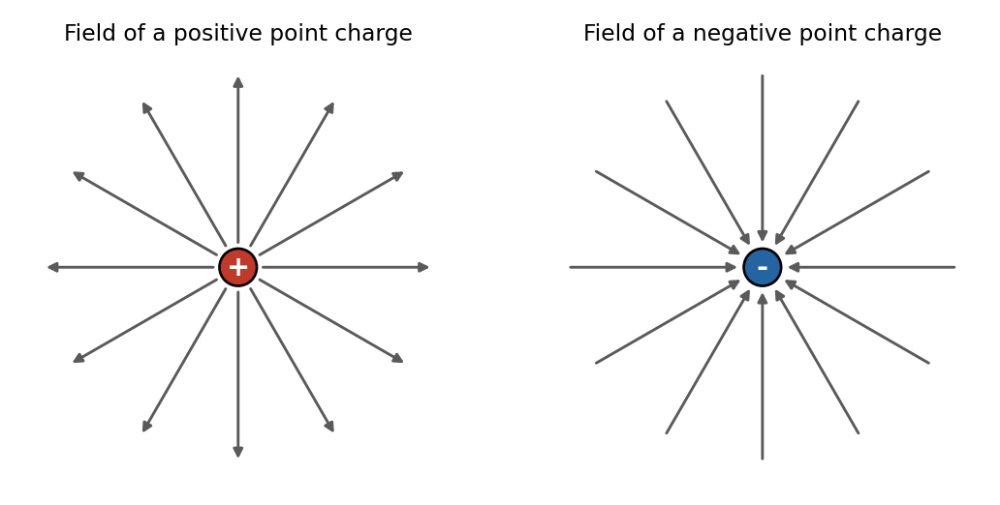

- The **length of the $\vec E$-vector** drawn at a point is proportional to the field's magnitude there, *or*
- The **density of field lines** through a region is proportional to the field's magnitude there.

Both pictures describe the same physical object; use whichever is more convenient for the argument you're making.

### 4.4 Symmetry: a very big idea in physics

A point charge looks *exactly the same* after any rotation, about any axis through its center. Since the field it produces must respect that same symmetry:

- The **direction** of the field must be purely radial: $\vec E(\vec r) = E(\vec r)\,\hat r$.
- The **magnitude** must depend only on distance $r$, never on angle: $E(\vec r) = E(r)$.

We say the point charge (and its field) exhibits **rotational symmetry**. This is not just a description of the point-charge result — it's a *technique*: throughout this course, you use the symmetry of a charge distribution to guess the *direction* of its field before ever writing an integral (see the ring, sheet, shell, and ball derivations in Section 9).

### 4.5 Field-line rules (always true, not just for point charges)

- Field lines **begin** on positive charge (or at infinity).
- Field lines **end** on negative charge (or at infinity).

### 4.6 Superposition of fields

The field at any point is the vector sum of the fields produced separately by every source charge:

$$
\vec E(P) = \vec E_1(P)+\vec E_2(P)+\cdots
$$

Inserting a charge $Q$ at $P$ *afterward* simply gives $\vec F_Q = Q\vec E(P)$ — the presence of $Q$ does not itself change $\vec E(P)$ (we assume $Q$ is a small "test charge" that doesn't disturb the source charges).

### 4.7 The far-field theorem for charged objects

> [!important] Far-field theorem
> Viewed from far away ($r\gg s$, where $s$ is the object's own size), **any** object with nonzero net charge $Q\ne0$ behaves electrically just like a single point charge:
> $$
> \vec E(\vec r) \approx \frac{kQ}{r^2}\hat r \qquad (r\gg s)
> $$

This is why, no matter how complicated a charged duck, rod, or disk looks up close, from across the room it just looks like a point charge $Q$ sitting at its center of charge.

### 4.8 Do neutral objects produce a field?

The $1/r^2$ far field above literally vanishes when $Q=0$ — but that does **not** mean $\vec E=0$ everywhere for a neutral object. It depends on whether the object has *internal charge separation*:

- An isolated **atom**: no separation of $+$ and $-$ charge on opposite sides → $\vec E_{\text{atom}}(\vec r) = 0$ everywhere.
- A **water molecule**: oxygen is more electronegative than hydrogen and pulls electron density toward itself → there *is* charge separation → $\vec E_{\text{molecule}}(\vec r) \ne 0$, even though the total charge is zero.

The prototype charge-neutral, charge-separated object is the **electric dipole** — the subject of the next section, and the key that explains this behavior quantitatively.

---

## 5. The Electric Dipole

Two charges $-q$ and $+q$, separated by a small distance $s$, form the prototype charge-neutral, charge-separated object.

### 5.1 The dipole moment vector

The **electric dipole moment** $\vec p$ points from $-q$ to $+q$ and has magnitude $p=qs$. More generally, for *any* collection of charges $q_k$ at positions $\vec r_k$:

$$
\vec p = \sum_{k=1}^N q_k \vec r_k
$$

(For the simple two-charge dipole, placing the origin at the midpoint, this reduces to $\vec p = qs\,\hat x$ pointing along the separation direction — you can verify: $\vec p = q_1\vec r_1+q_2\vec r_2 = e(s/2)\hat x + (-e)(-s/2)\hat x = qs\,\hat x$.)

### 5.2 On-axis field $\vec E_\parallel$: full derivation

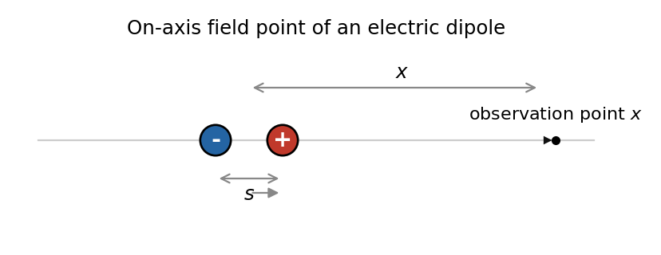

Restrict to points on the symmetry axis, i.e. points $(x,0,0)$. Call this field $\vec E_\parallel(x)$. **Strategy: superpose the two point-charge fields.**

With the $+q$ charge at $(s/2,0,0)$ and $-q$ at $(-s/2,0,0)$, distances from each to the field point are $r_+=x-s/2$ and $r_-=x+s/2$:

$$
\vec E_+ = k\frac{q}{r_+^2}\hat x, \qquad \vec E_- = k\frac{-q}{r_-^2}\hat x
$$

$$
\vec E_\parallel = \vec E_+ + \vec E_- = k\left[\frac{q}{(x-s/2)^2}-\frac{q}{(x+s/2)^2}\right]\hat x
$$

This is the **exact** result for any $x$. Taking $r\gg s$ (using the binomial approximation from Section 1.4):

$$
\vec E_\parallel(\vec r) \approx k\,\frac{2\vec p}{r^3}
$$

### 5.3 Perpendicular-bisector field $\vec E_\perp$: full derivation

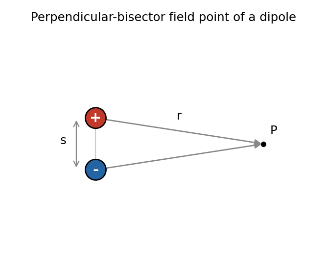

Now restrict to observation points on the axis *perpendicular* to the dipole's symmetry axis. By the geometry, the $x$-components of the two point-charge fields cancel ($E_x = -E_x'$) while the $y$-components add ($E_y=E_y'=-E_y\hat y$ each), giving $\vec E_\perp = \vec E + \vec E' = -2E_y\,\hat y$. Writing $E=kq/(r^2+(s/2)^2)$ and $\sin\theta = (s/2)/\sqrt{r^2+(s/2)^2}$:

$$
\vec E_\perp = -2E\sin\theta\,\hat y = -2\frac{kq}{r^2+(s/2)^2}\cdot\frac{s/2}{\sqrt{r^2+(s/2)^2}}\,\hat y
$$

Taking $r\gg s$:

$$
\vec E_\perp(\vec r) \approx -k\,\frac{\vec p}{r^3}
$$

### 5.4 Why bother defining $\vec p$?

Once you have $\vec p$, both special-case results compress into single expressions with no leftover reference to $q$ and $s$ separately:

$$
\vec E_\parallel \approx k\,\frac{2\vec p}{r^3}, \qquad \vec E_\perp \approx -k\,\frac{\vec p}{r^3}
$$

**Both fall off as $1/r^3$** (inverse cube) — a full power steeper than the $1/r^2$ of a single point charge. This $1/r^3$ signature is how you *recognize* a dipole field at a glance.

> [!tip] Units check (a technique worth stealing)
> Introduce the notation $[x]$ for "the units of $x$." We know $[E_q]=[k][q]/[r]^2$. We claim $[E_\parallel] = [k][2qs]/[r]^3 = [k][q]/[r]^2 \times [s]/[r]$. Since $[s]=[r]$ (both are lengths), the extra factor is dimensionless and $[E_\parallel]=[E_q]$ — consistent. Running a quick units check like this after every derivation catches algebra mistakes fast.

### 5.5 General dipole field at any point

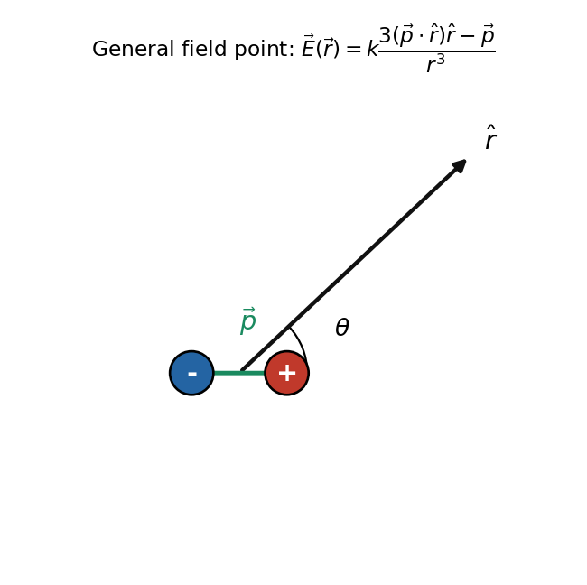

There is a single formula valid at *any* angle between $\vec p$ and $\hat r$ (not just on-axis or perpendicular):

$$
\vec E(\vec r) = k\,\frac{3(\vec p\cdot\hat r)\hat r - \vec p}{r^3}
$$

**Check against the two special cases:**
- $\hat r\perp\vec p$: then $\vec p\cdot\hat r=0$, so $\vec E(\vec r)=-k\vec p/r^3=\vec E_\perp$. ✓
- $\hat r\parallel\vec p$: then $\vec p\cdot\hat r = p$, so $\vec E(\vec r)=k(3\vec p-\vec p)/r^3=2k\vec p/r^3=\vec E_\parallel$. ✓

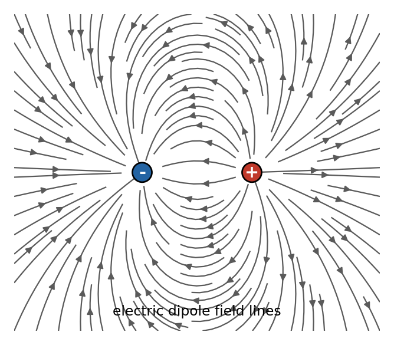

### 5.6 The far-field theorem for *any* neutral object

> [!important] Far-field theorem, extended
> Far away ($r\gg s$) from *any* object with zero net charge ($Q=0$) but nonzero dipole moment ($\vec p\ne0$), the field is *exactly* the dipole field above, using $\vec p=\sum q_k\vec r_k$ computed from the object's own charges.

This is precisely why a neutral water molecule still produces a nonzero field far away, while a neutral atom (no charge separation, $\vec p=0$) does not: the far field of *any* charge distribution is controlled by the first nonvanishing term in a hierarchy — net charge $Q$ first, then dipole moment $\vec p$ if $Q=0$, and so on.

**Other useful facts:** superposition still applies when combining a dipole's field with a point charge's field, or with another dipole's field; field lines still begin on $+$ charge and end on $-$ charge.

---

## 6. Polarization of Atoms, Molecules, and Matter

### 6.1 Induced polarization (nonpolar atoms and molecules)

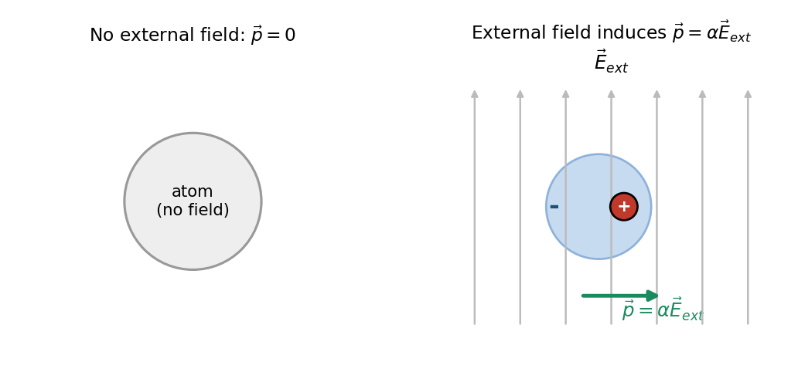

An external field $\vec E_{ext}$ pushes positive and negative charge within a neutral atom (or a nonpolar molecule, e.g. N₂) in *opposite* directions, since $\vec F = q\vec E_{ext}$ has opposite sign for $+$ and $-$ charge. The result is a small **induced dipole moment**:

$$
\vec p = \alpha\,\vec E_{ext}
$$

$\alpha$ is the atomic or molecular **polarizability** — a species-dependent constant you look up in a handbook. Crucially, $\vec p\to0$ the instant $\vec E_{ext}\to0$: there is nothing "permanent" about this dipole moment.

### 6.2 Permanent polarization (polar molecules)

In molecules like H₂O, chemical bonding *alone* — with no external field required — separates charge: oxygen is more electronegative than hydrogen and pulls electron density toward itself. The result is a **permanent** electric dipole moment $\vec p_{mol}$ that exists even when $\vec E_{ext}=0$. (You look these values up in handbooks, just like $\alpha$.)

### 6.3 Dipole–dipole interaction

Two **antiparallel** dipoles (e.g. two oppositely oriented water molecules) attract overall — the near ends (opposite charges, close together) attract more strongly than the far ends (also opposite charges, but farther apart) repel, so the net force is attractive. This is the microscopic origin of hydrogen bonding and a huge amount of everyday chemistry.

### 6.4 Force between a point charge and an induced dipole

A charge (say, an electron) at distance $d$ from a nonpolar molecule induces $\vec p=\alpha\vec E_O$ in that molecule. You cannot use $\vec F=Q\vec E$ directly on the molecule since the *neutral* molecule has $Q=0$ — instead use Newton's third law: compute the force the *molecule's induced dipole field* exerts back on the electron, then flip the sign.

$$
\vec F_e = -e\,\vec E_{\text{at }e}, \qquad \vec p = \alpha \vec E_O = \alpha\left(-k\frac{e}{d^2}\right)\hat x = -\frac{\alpha k e}{d^2}\hat x
$$

$$
\vec F_O = -\vec F_e = -\frac{2\alpha k^2 e^2}{d^5}\hat x
$$

This is an **attractive** force falling off as $1/d^5$ — a full three powers steeper than Coulomb's $1/d^2$, because one of the two "charges" involved is only *induced*, not fixed: as $d$ increases, not only does the ordinary Coulomb $1/d^2$ kick in, but the induced dipole moment itself *also* shrinks (since $E_O\propto 1/d^2$), giving extra powers of $1/d$.

### 6.5 How a bulk insulator polarizes

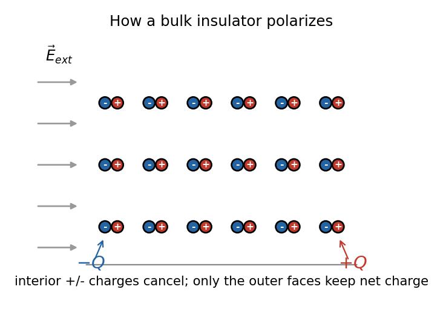

Every atom in the material acquires $\vec p_{\text{atom}}=\alpha\vec E_{ext}$. Picture the material as a lattice of tiny aligned dipoles: the $+$ end of one atom sits right next to the $-$ end of its neighbor, and these touching charges **cancel** throughout the interior. Only the outermost front and back faces are left with uncancelled net charge $\pm Q$. The whole body's dipole moment is therefore

$$
\vec p_{\text{body}} = \sum_{\text{atom}} \vec p_{\text{atom}} = Q\vec s
$$

i.e., equivalent to two point charges $\pm Q$ separated by the body's own thickness $\vec s$ — a "macro-dipole" built from billions of microscopic ones.

### 6.6 Field inside a polarized insulator

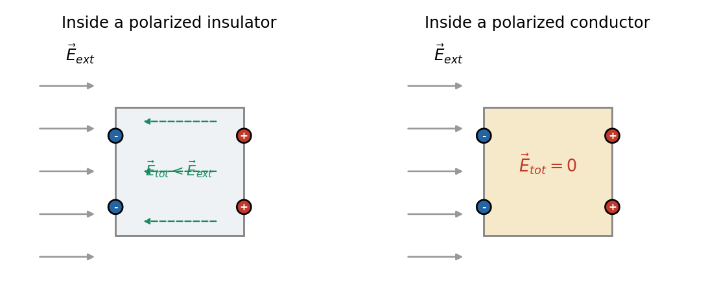

The surface polarization charges create their own field $\vec E_{pol}$ that points **opposite** to $\vec E_{ext}$ and *partially* cancels it:

$$
\vec E_{inside} = \vec E_{ext}+\vec E_{pol} = \vec E_{ext} - |\vec E_{pol}| = \frac{\vec E_{ext}}{\kappa}
$$

$\kappa>1$ is the **dielectric constant**: the interior field stays *parallel* to $\vec E_{ext}$ but is *reduced in magnitude*. Contrast this with a conductor (Section 7), where the cancellation is total.

---

## 7. Conductors and Insulators

### 7.1 The microscopic difference

- **Insulator:** every electron is bound to one particular atom — it cannot wander.
- **Conductor:** valence electrons migrate freely from atom to atom throughout the material.

This one microscopic fact is the root of every macroscopic difference between the two.

### 7.2 Charging methods

- **Frictional rubbing** transfers electrons between two initially neutral insulators (glass+silk, amber+wool); afterward the two objects carry equal and opposite charge. A rough triboelectric ranking, from *loses* electrons most easily to *gains* electrons most easily: human skin, glass, wool, cat fur, wood, silk, amber, rubber, styrofoam. *(For fun: one microscopic theory is that frictional motion breaks chemical bonds, the released bond energy locally heats each surface unequally, the temperature difference drives a thermoelectric field, and that field is what actually drives the electron transfer.)*
- **Charging a conductor by contact:** touch a charged insulating rod to a neutral conducting sphere — charge transfers onto the sphere and then spreads itself over the entire conducting surface.
- **Charging by polarization/induction:** bring a charged rod near two touching neutral conductors (which polarizes them), separate the two conductors *while the rod is still nearby*, then remove the rod. Result: two conductors left with equal and opposite charge, and the rod itself is completely unchanged.
- **Grounding:** connect a charged conductor to the Earth, and charge flows until the conductor is neutralized. This happens *spontaneously* — with no need for anything to "push" it — because it lowers the total electrostatic energy of the whole system, and systems evolve toward lower energy.

### 7.3 The conductor's "superpower": $\vec E=0$ inside, always

In electrostatic equilibrium, $\vec E=0$ at **every** point inside a conductor's material — regardless of the conductor's shape, regardless of what charges sit outside it or in a cavity within it. Mobile charges physically rearrange themselves on the surface(s) until the field *they* create exactly cancels any external field throughout the entire interior:

$$
\vec E_{inside} = \vec E_{ext} + \vec E_{pol} = 0 \quad\Rightarrow\quad |\vec E_{pol}| = |\vec E_{ext}|
$$

> [!important] The defining property of a conductor
> $E_{inside}=0$ **always**, for a conductor in electrostatic equilibrium — full cancellation, not the partial cancellation ($E_{inside}=E_{ext}/\kappa$) you get for an insulator.

**Why this must be true, physically:** if $\vec E\ne0$ anywhere inside a conductor, mobile charges there would feel a force and *keep moving* — by definition, that is not yet equilibrium. Equilibrium, for a conductor, is only reached once the internal field vanishes everywhere and nothing is left to push the charges around.

### 7.4 Shielding: the Faraday-cage effect

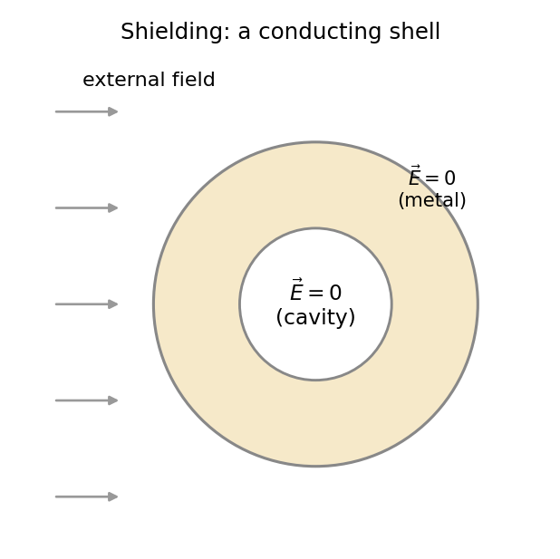

If you scoop a cavity out of a conductor, the surface charge still rearranges so that $\vec E=0$ throughout the solid conductor material — and, remarkably, $\vec E=0$ throughout the *empty cavity* too, as long as no charge sits inside the cavity itself. This is exactly why a conducting shell shields its interior from any external field — the working principle behind a Faraday cage.

### 7.5 Worked conceptual examples

- **Two point charges placed symmetrically around the center $C$ of a solid metal cube:** $E(C)=0$ — not because the two contributions happen to cancel, but simply because $C$ sits inside conductor material, and $E_{inside}=0$ *always*, no matter the external charge arrangement.
- **A dipole $\vec p$ held outside a solid metal cube**, at perpendicular distance $d$ from center $C$: this polarizes the cube. Since $E_{inside}$ must vanish, the cube's own field at $C$ must exactly cancel the dipole's field there: $\vec E_{cube}(C)=-\vec E_{dipole}(C)=+k\vec p/d^3$ (using $E_\perp=-k\vec p/d^3$ for this perpendicular geometry).
- **The same dipole outside a plastic (insulating) cube instead:** the cube still polarizes and produces its own field $\vec E_{cube}(\vec r)$, but nothing *forces* that field to cancel the dipole's field at $C$, so $\vec E_{total}(C)=\vec E_{dipole}(C)+\vec E_{cube}(C)\ne0$ in general. This contrast is the defining functional difference between a conductor and an insulator.
- **A positive point charge embedded at the center of an insulating sphere, itself coated with a thick conducting shell:** the shell's *outer* surface acquires charge equal in sign and magnitude to the embedded charge — because $\vec E=0$ must hold everywhere inside the metal, which forces the inner shell surface to carry $-q$ (canceling the embedded $+q$'s field within the metal) and, since the shell started neutral, the outer surface is left with $+q$.

---

## 8. Continuous Charge Distributions

Real objects spread their charge over a volume, a surface, or a line rather than concentrating it at isolated points.

### 8.1 Charge density

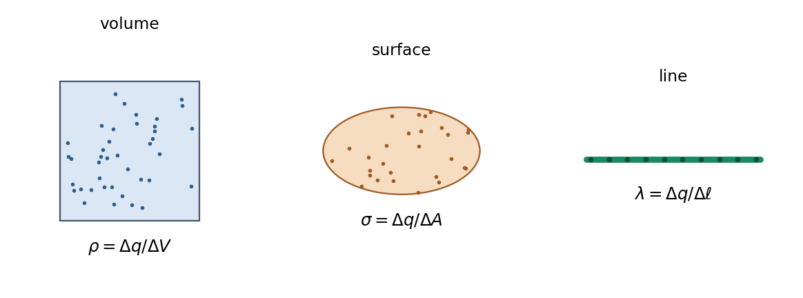

Define a charge density so that $dq$ is the charge contained in an infinitesimal volume, area, or length element:

$$
\text{volume: } \rho(\vec r)=\frac{\Delta q}{\Delta V}\ (dq=\rho\,dV), \qquad \text{surface: } \sigma=\frac{\Delta q}{\Delta A}\ (dq=\sigma\,dA), \qquad \text{line: } \lambda=\frac{\Delta q}{\Delta \ell}\ (dq=\lambda\,d\ell)
$$

For a **uniform** density, the charge $Q_0$ contained in a sub-volume $V_0$ of a total volume $V$ carrying total charge $Q$ is simply proportional: $Q_0 = \rho V_0 = QV_0/V$.

### 8.2 The general superposition integral

Treat the distribution as a continuum of infinitesimal point charges $dq$, and integrate the point-charge field formula over the entire source:

$$
\vec E(\vec r) = \int d\vec E = k\int \frac{\vec r-\vec r_q}{|\vec r-\vec r_q|^3}\,dq
$$

**The procedure, every time:**

1. Convert $dq$ using the density appropriate to the geometry ($\rho$, $\sigma$, or $\lambda$) and the geometry's own natural coordinate variables.
2. Use symmetry (Section 4.4) to argue away components that must cancel *before* you integrate — this is what makes these integrals tractable at all.
3. Integrate what's left over the limits appropriate to the object.

> [!warning] Why this integral is hard in general
> The terms being summed are **vectors** pointing in different directions at different points of the source. This makes the sum genuinely difficult except when the geometry has enough symmetry to argue away most of the components first — which is exactly why Section 9 only covers a specific, well-chosen list of shapes (line, ring, disk, sheet, shell, ball): these are the shapes where the symmetry argument actually works.

### 8.3 The far-field theorem still applies

If the total charge $Q=\int\rho\,dV\ne0$, then far from the object ($r\gg$ its own size), $\vec E(\vec r)\approx(kQ/r^2)\hat r$ — exactly as it would be for a point charge, no matter how complicated the near-field structure is.

---

## 9. Field of Standard Charge Distributions

### 9.1 Uniformly charged rod (length $L$, charge $q$, $\lambda=q/L$)

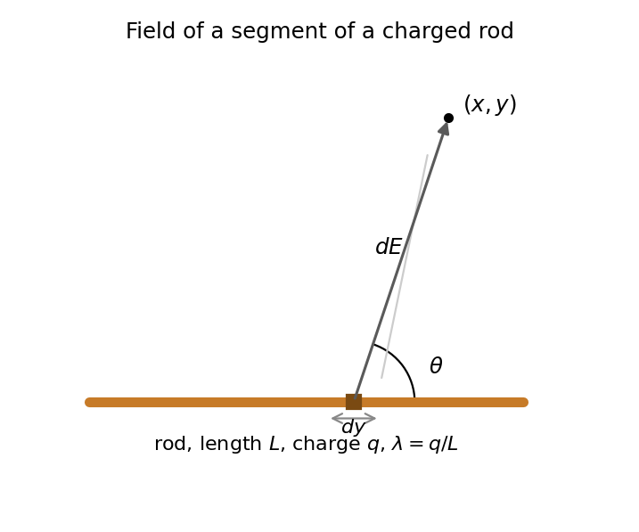

Divide the rod into segments of length $dy$, each carrying charge $dq=\lambda\,dy$ and acting as a point charge producing field $d\vec E$. With the rod along the $y$-axis and the field point at $(x,0)$ off-axis:

$$
dE = k\frac{dq}{r^2} = k\frac{\lambda\,dy}{x^2+y^2}, \qquad dE_x = dE\cos\theta = k\frac{q}{L}\frac{x\,dy}{(x^2+y^2)^{3/2}}, \qquad dE_y = dE\sin\theta = k\frac{q}{L}\frac{-y\,dy}{(x^2+y^2)^{3/2}}
$$

Integrating each component separately over the rod's length gives the field at any point *off* the midline — the limits of integration depend on where you place $y=0$ relative to the rod. **Along the perpendicular midline** specifically, the $y$-components from symmetric segments above and below cancel by up–down symmetry (a nice example of using symmetry to simplify *before* finishing the integral), leaving only:

$$
E_x(x,0) = \frac{kq}{x\sqrt{x^2+(L/2)^2}}, \qquad E_y(x,0)=0
$$

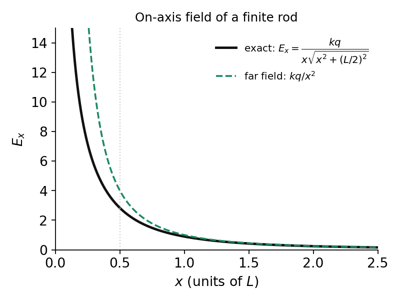

**Two important limits:**

- **Far** from the rod ($x\gg L$): $E_x\to kq/x^2$ — the far-field theorem, right on schedule.
- **Close** to the rod ($x\ll L$), or equivalently an **infinite line charge** with linear density $\lambda$:

$$
E_x(x,0) = k\frac{q}{x\sqrt{x^2+(L/2)^2}} \xrightarrow{x\ll L} k\frac{2(q/L)}{x} = \frac{2k\lambda}{x}
$$

and then, by the rotational symmetry of an *infinite* line about its own axis:

$$
\vec E(\vec s) = \frac{2k\lambda}{s}\,\hat s
$$

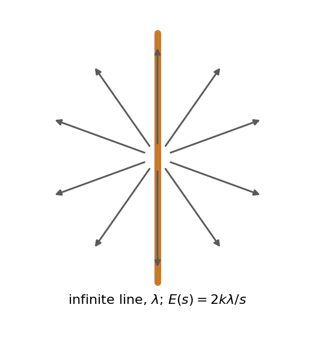

($\vec s$ points radially outward from the line's axis) — this falls off as **$1/s$**, not $1/s^2$: a genuinely different power law from a point charge, because the source is spread along an infinite line rather than concentrated at a point.

### 9.2 Uniformly charged ring (radius $R$, charge $q$), on-axis

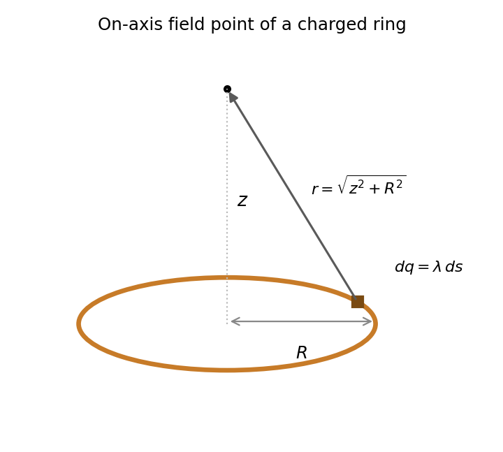

By rotational symmetry about the ring's own axis, the *perpendicular* (radial) components of $d\vec E$ from diametrically opposite elements cancel; only the axial ($z$) component survives:

$$
dE_z = dE\cos\theta, \qquad dq = \lambda\,ds = \frac{q}{2\pi}\,d\phi
$$

$$
E_z(z)=\int dE_z = k\frac{qz}{(z^2+R^2)^{3/2}}\int_0^{2\pi}\frac{d\phi}{2\pi} = \frac{kqz}{(z^2+R^2)^{3/2}}
$$

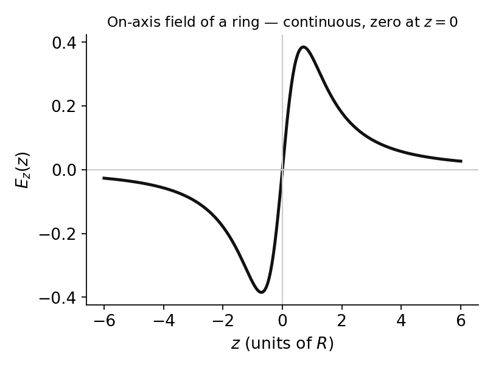

- Far away ($z\gg R$): $E_z\to kq/z^2$ (far-field theorem, again).
- $E_z(z)$ is **continuous everywhere**, equal to zero at $z=0$, and peaks at a finite $z$ — no discontinuity for a ring, because the ring's charge is spread over a curve with no single sharp "surface" to cross perpendicular to the field.

### 9.3 Uniformly charged disk (radius $R$, $\sigma=q/\pi R^2$), on-axis

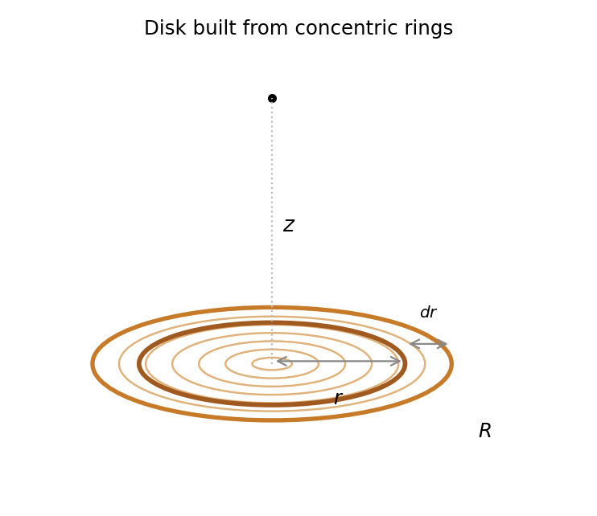

Build the disk from concentric rings of radius $r$, width $dr$, each carrying charge $dq=\sigma\cdot2\pi r\,dr$, and sum their (already-derived) on-axis fields:

$$
dE_z(z) = k\frac{z\,dq}{(z^2+r^2)^{3/2}} = k\sigma\frac{2\pi r z\,dr}{(z^2+r^2)^{3/2}}
$$

$$
E_z(z)=\int_0^R dE_z = 2\pi k\sigma z\int_0^R \frac{r\,dr}{(z^2+r^2)^{3/2}} = 2\pi k\sigma\left[\frac{z}{|z|}-\frac{z}{\sqrt{z^2+R^2}}\right]
$$

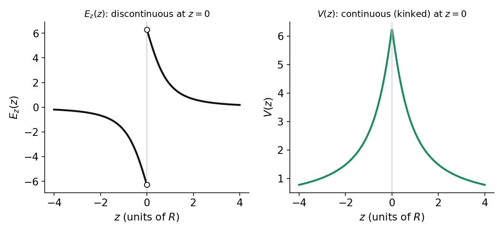

$E_z(z)$ is **discontinuous** at $z=0$ (it jumps from $-2\pi k\sigma$ to $+2\pi k\sigma$ as you cross the disk).

> [!important] The discontinuity rule
> $E$ is always discontinuous when the observation point crosses an infinitesimally thin *charged surface*. Compare with the ring (a charged *curve*, no discontinuity) and the solid ball later in this section (charge fills a *volume*, no discontinuity).

### 9.4 Infinite flat sheet of charge ($\sigma$)

Taking $z\ll R$ in the disk result above (equivalently, letting $R\to\infty$):

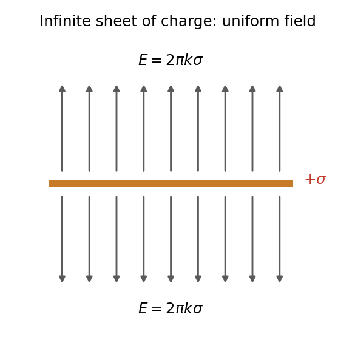

$$
E_z(z) = 2\pi k\sigma\,\frac{z}{|z|} = \begin{cases}+2\pi k\sigma & z>0\\-2\pi k\sigma & z<0\end{cases}
$$

The field is **uniform**: magnitude $|E|=2\pi k\sigma$ on *both* sides, pointing away from the sheet if $\sigma>0$ (toward it if $\sigma<0$), and — this is the surprising part — completely **independent of distance** from the sheet.

### 9.5 Two parallel infinite sheets, charges $+\sigma$ and $-\sigma$

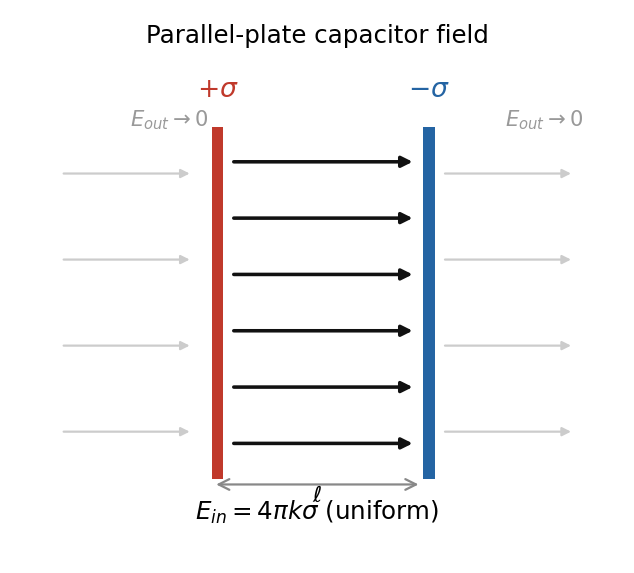

Superposing the two sheet fields (each of magnitude $2\pi k\sigma$):

$$
E_{\text{between}} = 4\pi k\sigma\ \text{(the two fields add)}, \qquad E_{\text{outside both}} = 0\ \text{(the two fields cancel)}
$$

This is the idealized **parallel-plate capacitor**: a uniform field $E_{in}=4\pi k\sigma$ exists *only* between the plates, and $E_{out}=0$ everywhere outside them.

### 9.6 Hollow spherical shell of charge (radius $R$, total charge $Q$, $\sigma=Q/4\pi R^2$)

Combine spherical symmetry with the far-field theorem: the field far away *must* look like a point charge $Q$, and rotational symmetry about the shell's center leaves no other functional form possible close in either:

$$
\vec E_{\text{out}}(r) = \frac{kQ}{r^2}\hat r\ (r>R), \qquad \vec E_{\text{in}}(r) = 0\ (r<R)
$$

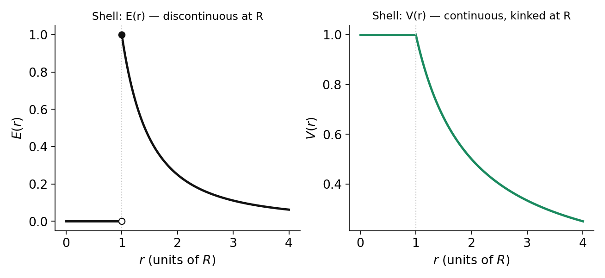

**Discontinuous** at $r=R$ (jumps from $0$ to $kQ/R^2$) — once again, an infinitesimally thin charged surface. *(A full proof of $E_{in}=0$ by direct integration of the superposition integral is possible, but considerably more work; the symmetry-plus-far-field shortcut above gets you the same answer far faster, and this shortcut is exactly what generalizes into Gauss's law later in the course.)*

### 9.7 Solid uniformly charged ball (radius $R$, total charge $Q$, $\rho=Q/(\tfrac43\pi R^3)$)

**Outside** the ball, the identical far-field/symmetry argument as the shell applies:

$$
\vec E_{\text{out}}(r) = \frac{kQ}{r^2}\hat r\quad (r>R)
$$

**Inside** the ball, build it from nested spherical shells. The key trick: the inner sphere of radius $r<R$ (which encloses charge $Q(r)=Q\,r^3/R^3$, since charge is uniform and volume scales as $r^3$) acts exactly like a point charge $Q(r)$ at the observation point, while *every* shell of material sitting outside radius $r$ contributes **zero** field there — because we just showed $E_{in}=0$ for a shell in Section 9.6, and that result applies to each of these outer shells individually. Therefore

$$
\vec E_{\text{in}}(r) = \frac{kQ(r)}{r^2}\hat r = \frac{k}{r^2}\cdot\frac{Qr^3}{R^3}\,\hat r = k\frac{Q}{R^3}\,r\,\hat r\quad (r<R)
$$

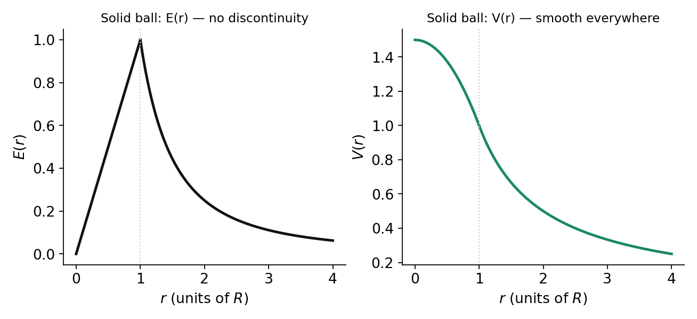

$E_{in}$ grows **linearly** with $r$ and matches $E_{out}=kQ/R^2$ exactly at $r=R$ — **no discontinuity**, because here the charge is spread through a genuine 3D volume, not concentrated on an infinitesimally thin surface.

> [!important] Pattern to remember for the whole course
> $E$ is **discontinuous** crossing an infinitesimally thin charged surface (disk, sheet, shell). $E$ is **continuous** crossing into a region where charge fills a volume (solid ball). This single rule lets you sanity-check almost any field result you derive.

---

## 10. Work, Energy, and Electric Potential Energy

### 10.1 A brief review of particle mechanics (PHYS 2211)

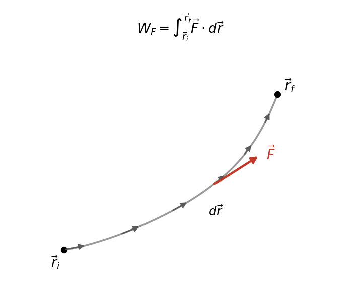

The work $W_F$ done by a force $\vec F(\vec r)$ as an object moves from $\vec r_i$ to $\vec r_f$ is a **line integral**:

$$
W_F = \int_{\vec r_i}^{\vec r_f} \vec F(\vec r)\cdot d\vec r
$$

$dW_F>0$ when $\vec F$ and $d\vec r$ point more parallel than anti-parallel (the force helps the motion along); $dW_F<0$ when they point more anti-parallel than parallel (the force resists the motion).

### 10.2 Conservation of total energy

The **work–kinetic-energy theorem** says this same work integral equals $\Delta K = K_f-K_i$. **Potential energy** $U$ is *defined* so that $-\Delta U$ equals that identical work integral:

$$
U(\vec r_f)-U(\vec r_i) = -\int_{\vec r_i}^{\vec r_f}\vec F(\vec r)\cdot d\vec r = W_F = \Delta K
$$

Total energy $E=K+U$ is then automatically conserved: $E_i=K_i+U(\vec r_i)=K_f+U(\vec r_f)=E_f$, i.e. $\Delta E=0\Rightarrow\Delta K=-\Delta U$.

### 10.3 Applying this to the electric force

For a point charge $q$, the electric force is $\vec F(\vec r)=q\vec E(\vec r)$, so

$$
U(\vec r_f)-U(\vec r_i) = -\int_{\vec r_i}^{\vec r_f} q\,\vec E(\vec r)\cdot d\vec r
$$

### 10.4 Defining the electric potential: a seemingly trivial but hugely useful step

Divide both sides by $q$ and define $V(\vec r)\equiv U(\vec r)/q$. This single algebraic move removes the test charge $q$ from the equation entirely — mirroring exactly how factoring $Q$ out of Coulomb's law produced the electric field in Section 4.2:

$$
V(\vec r_f)-V(\vec r_i) = -\int_{\vec r_i}^{\vec r_f}\vec E(\vec r)\cdot d\vec r, \qquad U(\vec r)=qV(\vec r)
$$

$V(\vec r)$ depends only on the **source** charges (through $\vec E$), never on the test charge $q$ — that is exactly what makes it so broadly useful.

---

## 11. Electric Potential $V(\vec r)$

### 11.1 Units

$$
[V] = \frac{[U]}{[q]} = \frac{\text{joule}}{\text{coulomb}} = \text{volt}
$$

named after Alessandro Volta (1745–1827), inventor of the battery.

### 11.2 Two ways to move between $\vec E$ and $V$

$$
V(\vec r_2)-V(\vec r_1) = -\int_{\vec r_1}^{\vec r_2} \vec E\cdot d\vec r \qquad\text{(if you know the field — integrate it)}
$$

$$
E_x = -\frac{\partial V}{\partial x}, \qquad E_y = -\frac{\partial V}{\partial y}, \qquad E_z = -\frac{\partial V}{\partial z} \qquad\text{(if you know the potential — differentiate it)}
$$

**Where the second line comes from:** from the definition of work, $dV=-E_xdx-E_ydy-E_zdz$. Ordinary multivariable calculus says $dV = \frac{\partial V}{\partial x}dx+\frac{\partial V}{\partial y}dy+\frac{\partial V}{\partial z}dz$ for any function $V(x,y,z)$. Comparing term by term gives the three partial-derivative relations above.

> [!tip] Why you'd ever prefer $V$ over $\vec E$
> Calculate the *scalar* function $V(\vec r)$ from the source charges, then take derivatives to recover $\vec E(\vec r)$ — this is very often much easier than performing the vector superposition integral for $\vec E$ directly, precisely because $V$ is a single scalar function rather than three components pointing in different directions that all have to be tracked separately.

### 11.3 $V(\vec r)$ for a point charge at the origin: full derivation

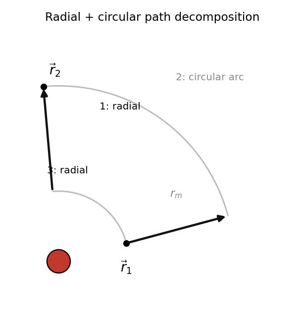

Choose a path from $\vec r_1$ to $\vec r_2$ built from only two kinds of segments: **radial** segments (where $d\vec r\parallel\hat r$, so $\hat r\cdot d\vec r=dr$) and **circular arcs** (where $d\vec r\perp\hat r$, so $\hat r\cdot d\vec r=0$). Only the radial segments contribute anything to the integral:

$$
V(\vec r_2)-V(\vec r_1) = -\int_{\vec r_1}^{\vec r_2} k\frac{q}{r^2}\hat r\cdot d\vec r = -\int_{r_1}^{r_2} k\frac{q}{r^2}\,dr = \frac{kq}{r_2}-\frac{kq}{r_1}
$$

Choosing the reference point at infinity ($V(\infty)=0$, the conventional choice for any finite charge distribution) gives the standard result:

$$
\boxed{V(\vec r) = \frac{kq}{r}}
$$

**Check by working backward:** differentiating $V(r)=kq/r$ with respect to $x,y,z$ (using $r=\sqrt{x^2+y^2+z^2}$) exactly reproduces the point-charge field:

$$
E_x = -\frac{\partial}{\partial x}\frac{kq}{r} = \frac{kq}{r^3}x, \quad\text{similarly for } E_y,E_z \quad\Rightarrow\quad \vec E(\vec r)=\frac{kq}{r^3}\vec r=\frac{kq}{r^2}\hat r
$$

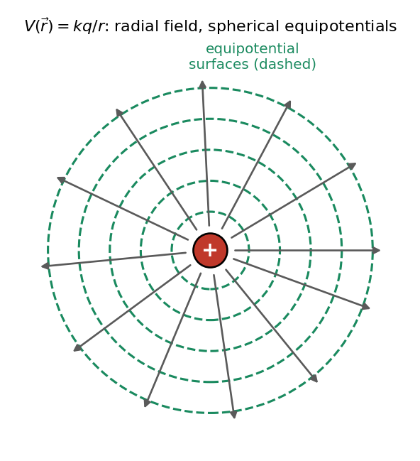

### 11.4 Path independence of $\Delta V$

Because *any* path at all from $\vec r_1$ to $\vec r_2$ can be broken down into a sequence of radial and circular segments, the identical result holds no matter which path you actually integrate along — this argument is not special to point charges, it is always true for an electrostatic field.

### 11.5 Consequence: closed loops

Going from $A$ to $B$ along one path and back along a *different* path must give contributions that exactly cancel (since both paths give the same $\Delta V$):

$$
\oint \vec E(\vec r)\cdot d\vec r = 0 \qquad\text{around any closed loop}
$$

*It's true for point charges — it's true always.* (This single equation is, in fact, the defining statement that an electrostatic field is *conservative*, and it will resurface, generalized, when you meet Faraday's law of induction later in the course.)

### 11.6 Superposition for $V(\vec r)$: a scalar sum

Unlike the field — which sums as vectors — the potential produced by $N$ point charges sums as **ordinary scalars**: no components, no directions to track.

$$
V(\vec r) = \sum_{i=1}^N \frac{kq_i}{r_i}, \qquad r_i=|\vec r-\vec r_i|
$$

This scalar superposition is one of the single biggest practical advantages of working with $V$ instead of $\vec E$.

**Worked example: two equal positive charges.** Two point charges $q,q$, both positive and equal, sit apart. At point $P$ on the line joining them, $V(P)=kq/r_1+kq/r_2\ge0$ always — it can equal zero only infinitely far from both charges. **Contrast this with $\vec E$** for the *same* configuration: $\vec E$ *can* be exactly zero at a finite point (e.g. the midpoint between two equal charges), because it adds as vectors that can cancel — whereas $V$ adds as scalars that, for two same-sign charges, never cancel at any finite distance.

---

## 12. Electric Potential of Continuous Charge Distributions

### 12.1 General integral

Exactly as for the field, treat the distribution as a continuum of point charges $dq$ and sum the point-charge *potential* over the whole source. Because potential is a **scalar**, this integral has no components to track — a significant simplification compared with the analogous field integral:

$$
V(\vec r) = \sum_{i=1}^N \frac{kq_i}{|\vec r-\vec r_i|} \quad\Rightarrow\quad V(\vec r) = \int \frac{k\,dq}{|\vec r-\vec r_{dq}|}
$$

where $\vec r_{dq}$ points from the origin to the element of charge $dq$.

### 12.2 Uniformly charged ring (radius $R$, charge $Q$), on-axis

Every element $dq$ around the ring is exactly the same distance $r=\sqrt{z^2+R^2}$ from an on-axis observation point, so that distance factors straight out of the integral:

$$
dV = k\frac{dq}{r} = k\frac{dq}{\sqrt{z^2+R^2}} \quad\Rightarrow\quad V(z)=\int dV = \frac{k}{\sqrt{z^2+R^2}}\int dq = \frac{kQ}{\sqrt{z^2+R^2}}
$$

Differentiating recovers the on-axis ring field from Section 9.2, confirming consistency between the two independent derivation methods:

$$
E_z(z) = -\frac{dV}{dz} = \frac{kQz}{(z^2+R^2)^{3/2}}
$$

### 12.3 Uniformly charged disk (radius $R$, $\sigma=Q/\pi R^2$), on-axis

Treat every annular ring of radius $r$, width $dr$, charge $dq=\sigma\,dA=\sigma(2\pi r\,dr)$ as a ring source and sum the (already-derived) ring potentials from $r=0$ to $r=R$:

$$
dV = k\frac{dq}{\sqrt{z^2+r^2}} = k\sigma\frac{2\pi r\,dr}{\sqrt{z^2+r^2}}
$$

$$
V(z) = 2\pi k\sigma \int_0^R \frac{r\,dr}{\sqrt{z^2+r^2}} = 2\pi k\sigma\left[\sqrt{z^2+R^2}-|z|\right]
$$

> [!important] $V$ is continuous, $E$ is not
> $V(z)$ has **no jump** at $z=0$ ($V$ is *always* continuous crossing an infinitesimally thin charged surface, even though it does have a *kink* — a discontinuous slope — there). Differentiating $V(z)$ gives back the disk field from Section 9.3, which *is* discontinuous at $z=0$:
> $$
> E_z(z) = -\frac{dV}{dz} = 2\pi k\sigma\left[\frac{z}{|z|}-\frac{z}{\sqrt{z^2+R^2}}\right]
> $$

**Infinite-plane limit ($z\ll R$).** Approximating $\sqrt{z^2+R^2}\approx R$:

$$
V(z) \approx 2\pi k\sigma\left[R-|z|\right] = 2\pi k\sigma R - 2\pi k\sigma|z| \quad\Rightarrow\quad E_z(z) = -\frac{dV}{dz} = \pm2\pi k\sigma
$$

matching the infinite-sheet field from Section 9.4. (Interestingly, $V$ itself grows *without bound* as the sheet's radius grows, which is why an infinite sheet has no well-defined reference $V(\infty)=0$ — only $\vec E$ stays well-behaved in that limit, not $V$.)

**Point-charge limit ($z\gg R$).** Write $\sqrt{z^2+R^2}=|z|\sqrt{1+R^2/z^2}$ and apply the binomial approximation (Section 1.4) with $n=1/2$: $\sqrt{1+x}\approx1+x/2$:

$$
V(z) = 2\pi k\sigma\left[|z|\sqrt{1+\tfrac{R^2}{z^2}}-|z|\right] \approx 2\pi k\sigma\,|z|\left(1+\tfrac12\tfrac{R^2}{z^2}\right)-2\pi k\sigma|z| = 2\pi k\sigma\,\frac{R^2}{2|z|} = \frac{kQ}{|z|}
$$

(using $Q=\sigma\pi R^2$) — the far-field theorem again, now demonstrated for the potential.

### 12.4 Hollow spherical shell (radius $R$, total charge $Q$)

**Outside** ($r>R$): $\vec E_{out}(r)$ is *identical* to the field of a point charge $Q$, and both the observation point $r$ and the reference point $\infty$ are outside the shell, so $V_{out}(r)$ must equal the ordinary point-charge potential:

$$
V_{\text{out}}(r) = \frac{kQ}{r} \qquad (r>R)
$$

**Inside** ($r<R$): since $E_{in}(r)=0$ everywhere inside (Section 9.6), the integral of $\vec E_{in}$ between *any* two interior points is zero — so $V$ is **constant** throughout the interior. Matching that constant value to $V_{out}$ right at the boundary $r=R$ gives:

$$
V_{\text{in}}(r) = \frac{kQ}{R} \qquad (r<R,\ \text{constant})
$$

So $E$ jumps discontinuously at $r=R$, while $V$ is continuous there (the two pieces match at the boundary) but has a kink — a discontinuous *slope* — consistent with $E=-dV/dr$ jumping right at that point.

### 12.5 Solid uniformly charged ball (radius $R$, total charge $Q$)

**Outside** ($r>R$), the same reasoning as the shell gives $V_{out}(r)=kQ/r$. **Inside**, integrate $E(r)$ inward from infinity (using $E_{in}(r)=kQr/R^3$ from Section 9.7):

$$
V_{\text{in}}(r) = \frac{kQ}{2R}\left(3-\frac{r^2}{R^2}\right) \qquad (r<R)
$$

This matches $V_{out}(R)=kQ/R$ right at the boundary (plug in $r=R$: $\tfrac{kQ}{2R}(3-1)=kQ/R$ ✓) and **peaks at the center** with $V_{in}(0)=3kQ/2R$. Unlike the shell, $E$ has no jump at all for a solid ball (Section 9.7), and correspondingly $V$ here is **smooth everywhere**, with no kink anywhere — not even at $r=R$.

---

## 13. Capacitance and Dielectrics

### 13.1 The ideal parallel-plate capacitor

Two oppositely charged infinite sheets ($+\sigma$ and $-\sigma$) separated by a gap of length $\ell$ produce a uniform field $E=4\pi k\sigma$ between them (Section 9.5). Integrating the straight-line path from the $+$ plate ($x=0$) to the $-$ plate ($x=\ell$):

$$
\Delta V = V_- - V_+ = -\int_0^{\ell} E\hat x \cdot dx\,\hat x = -E\ell = -4\pi k\sigma \ell = -\frac{Q}{C}
$$

$$
C \equiv \frac{Q}{|\Delta V|} = \frac{Q}{4\pi k(Q/A)\ell} = \frac{A}{4\pi k\ell}
$$

$C$, the **capacitance**, is a purely geometric quantity (depending only on plate area $A$ and separation $\ell$) that tells you how much charge $Q$ the plates hold *per volt* of potential difference between them.

### 13.2 A real parallel-plate capacitor

Real metal plates of area $A$ carrying charge $Q$ (so $\sigma=Q/A$) reproduce the ideal picture in the bulk of the gap — $E_{in}\approx4\pi k\sigma$ between the plates, $E_{out}\approx0$ outside them, and $E=0$ inside the metal of the plates themselves (Section 7.3) — *except* near the edges, where field lines bulge outward as a **fringe field**: a real-world deviation from the idealized uniform-field picture, and the reason the ideal formula is only an approximation for a finite real capacitor.

### 13.3 Dielectric constant of common materials

| Material | $\kappa$ |
| --- | --- |
| Vacuum | 1.0000 |
| Air (1 atm) | 1.0006 |
| Paraffin | 2.2 |
| Polystyrene | 2.6 |
| Vinyl (plastic) | 2–4 |
| Paper | 3.7 |
| Quartz | 4.3 |
| Oil | 4 |
| Glass, Pyrex | 5 |
| Rubber, neoprene | 6.7 |
| Porcelain | 6–8 |
| Mica | 7 |
| Water (liquid) | 80 |
| Strontium titanate | 300 |

### 13.4 Inserting a dielectric

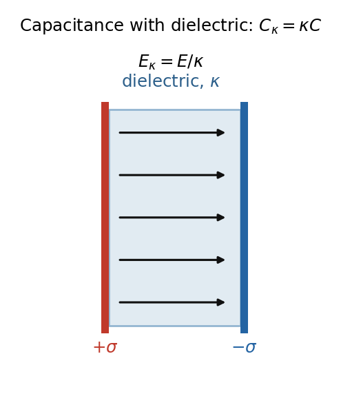

Slipping an insulator between the charged plates polarizes it exactly as described in Section 6.6: the induced surface charge creates a field that partially cancels the plates' field, so the field *inside* the dielectric is reduced:

$$
E_\kappa = \frac{E}{\kappa}
$$

**Potential and capacitance with a dielectric.** The potential difference across the gap shrinks in exact proportion:

$$
|\Delta V| = E\ell \quad(\text{no dielectric}), \qquad |\Delta V_\kappa| = E_\kappa\ell = \frac{E}{\kappa}\ell \quad(\text{with dielectric})
$$

Since $C=Q/|\Delta V|$ and $\Delta V$ dropped by a factor of $\kappa$ while $Q$ stayed exactly the same:

$$
C_\kappa = \frac{Q}{|\Delta V_\kappa|} = \kappa C > C
$$

> [!important] Key takeaway
> Inserting a dielectric between the plates of a capacitor **always increases** its capacitance — this is why real capacitors are filled with dielectric material rather than left as vacuum gaps.

### 13.5 Potential across a conductor

Because $\vec E(\vec r)=0$ everywhere inside a conductor in electrostatic equilibrium (Section 7.3), the potential difference between *any* two points $i$ and $f$ inside (or on the surface of) the conductor is:

$$
V_f - V_i = -\int_{\vec r_i}^{\vec r_f} \vec E(\vec r)\cdot d\vec r = 0
$$

So $V(\vec r)=\text{constant}$ everywhere inside and on the surface of a conductor in equilibrium. *(Spoiler alert: this stops being true once electric current starts flowing through a conductor — that's a preview of circuits, covered later in the course.)*

---

## 14. Worked Conceptual Examples (Clicker-Question Digest)

These are the reasoning patterns tested throughout the first five weeks — read them as a diagnostic: if any one of these feels unfamiliar, go back to the referenced section.

**1. Which quadrant places a negative charge $Q$ so the net force on a negative charge at the origin is zero?** (Section 3.4) Work out the force from the *known* charges first, then ask what additional force — in both direction *and* magnitude — would exactly cancel it. The charge producing that canceling force can be either sign, depending on which side of the origin you place it (attraction vs. repulsion flips with sign, but so does which side pulls "the right way").

**2. Sketching field lines for two point charges.** (Section 4.5–4.6) Two rules do all the work: very close to either individual charge, the field must locally resemble that single isolated point charge's radial pattern; and any point of exact symmetry between equal-and-opposite or equal-and-same charges may (or may not) have $\vec E=0$, which you check directly from superposition.

**3. Electric field of a "duck" with net negative charge, viewed from far away.** (Section 4.7) However lumpy the near-field lines look up close, *every* field line shown at large distance must still terminate on the duck (since it's negatively charged, field lines end there) — the far-field theorem guarantees the large-scale pattern looks exactly like that of a single point charge equal to the duck's total charge.

**4. Two charges $+2q$ and $-q$: does the field look like a dipole?** (Sections 4.7, 5.6) **No.** The net charge is $Q=2q-q=q\ne0$, so the far-field theorem for *charged* objects applies: far away, this looks like a single point charge $+q$, falling off as $1/r^2$ — not like a dipole's $1/r^3$. The dipole far-field formula only kicks in when $Q=0$ exactly.

**5. Water molecule polarizing a neutral atom nearby.** (Section 6.1, 6.4) The polar molecule's own field polarizes the initially-unpolarized neutral atom, inducing a dipole moment in it; the two dipoles then interact exactly as in Section 6.3 — an overall attractive force (near-end attraction beats far-end repulsion).

**6. Force $\vec F_1$ on an electron near a polarized H₂O molecule vs. force $\vec F_2$ on a different electron near a polarized O₂ molecule.** The key insight in problems like this: identify what physical vector (the source dipole moment, or the field it produces) actually controls the direction of the force in question, and compare the *geometry* of the two setups — parallel, anti-parallel, or perpendicular — rather than re-deriving each force from scratch.

**7. Charge sitting inside an uncharged conducting shell with thick walls.** (Section 7.5) The shell's *inner* surface acquires charge opposite in sign to the enclosed charge (forcing $E=0$ within the metal itself); since the shell overall is neutral, its *outer* surface is left with charge equal in sign and magnitude to the enclosed charge.

**8. Insulating block with two nearby charged balls — field at the midpoint, and at the block's center.** (Section 6.5–6.6) There are *three* contributions to add by superposition: the field from each of the two external balls, *plus* the field from the block's own induced polarization charges — and importantly, the induced field $E_{pol}$ never fully cancels the external field for an insulator (contrast a conductor, where it would cancel completely).

**9. An electron moving in the direction of $\vec E$ between two oppositely charged parallel sheets.** (Sections 10.1–10.2) Since the electron's charge is negative, $\vec F=q\vec E$ points *opposite* to $\vec E$, so the electron decelerates as it moves in the direction of $\vec E$: $\Delta K<0$. Total energy conservation ($\Delta K+\Delta U=0$) then forces $\Delta U>0$ by exactly the same amount.

**10. Four parallel sheets stacked $+\sigma,-\sigma,+\sigma,-\sigma$: field between the second and third sheets.** (Section 9.5) A direct application of superposition to more than two sheets: at a point sitting *between* the two capacitor-like pairs, the contributions from all four sheets happen to superpose to exactly zero — showing that stacking oppositely oriented plate-pairs back-to-back can produce field-free regions between them.

**11. Field at the center of a shell, due to a nearby charged solid ball.** (Section 9.6) The total field is the vector sum of two contributions: the field the shell produces *at its own center*, which is exactly zero (Section 9.6, always true for a shell); and the field the ball produces there, which — since the shell's center is outside the ball — is simply that of a point charge $Q_2$ at distance $d$: $kQ_2/d^2$. The shell's zero self-field is what makes this kind of superposition problem tractable.

**12. Where is $V(\vec r)=0$ for two charges of opposite sign, treated as point charges?** (Section 11.6) Unlike $\vec E$, which can vanish at an isolated finite point, $V=0$ for two *opposite*-sign point charges occurs on an entire locus of points (generically a curved surface, not just the midpoint) where the two contributions $kq_1/r_1$ and $kq_2/r_2$ exactly cancel — you have to actually solve $kq_1/r_1+kq_2/r_2=0$ rather than guess by symmetry, unless the two charges have equal magnitude.

**13. Potential $V_A$ from three point charges at three corners of a rectangle, evaluated at the fourth corner.** (Section 11.6) Using scalar superposition with the *correct* distance from each individual charge — not a shared distance — and keeping each charge's algebraic sign explicit:
$$
V_A = \frac{kQ_1}{x} - \frac{kQ_2}{\sqrt{x^2+y^2}} + \frac{kQ_3}{y}
$$
The lesson: each term uses the straight-line distance from *that specific* charge to the point in question, and every charge's sign carries straight through the sum since $V$-superposition is a plain scalar sum (Section 11.6) — no vector components to keep track of, but also no shortcuts on the distances or the signs.

---

## 15. Quick-Reference Formula Sheet

Constants: $e = 1.602\times10^{-19}$ C, $k=1/(4\pi\epsilon_0) = 9\times10^9$ N·m²/C².

### 15.1 Coulomb's Law, Fields, and Forces

| Concept | Formula |
| --- | --- |
| Coulomb's Law | $\vec F_{21} = kq_1q_2\,\dfrac{\vec r_2-\vec r_1}{\lVert\vec r_2-\vec r_1\rVert^3}$ |
| Field of a point charge | $\vec E(\vec r) = \dfrac{kq}{r^2}\hat r$ |
| Force from a field | $\vec F = Q\vec E$ |
| Far-field, net charge $Q$ | $\vec E \approx \dfrac{kQ}{r^2}\hat r$, for $r\gg s$ |

### 15.2 Electric Dipole

| Concept                     | Formula                                                              |     |
| --------------------------- | -------------------------------------------------------------------- | --- |
| Dipole moment               | $\vec p = qs$ (points $-q\to+q$); general: $\vec p=\sum q_k\vec r_k$ |     |
| Dipole field, on-axis       | $\vec E_\parallel \approx k\dfrac{2\vec p}{r^3}$                     |     |
| Dipole field, ⊥ bisector    | $\vec E_\perp \approx -k\dfrac{\vec p}{r^3}$                         |     |
| Dipole field, general point | $\vec E(\vec r) = k\dfrac{3(\vec p\cdot\hat r)\hat r-\vec p}{r^3}$   |     |

### 15.3 Polarization, Conductors, and Insulators

| Concept | Formula |
| --- | --- |
| Induced dipole moment | $\vec p = \alpha\vec E_{ext}$ |
| Force: point charge on induced dipole | $F_O = -2\alpha k^2 e^2/d^5$ (attractive, toward the charge) |
| Bulk insulator dipole moment | $\vec p_{body} = Q\vec s$ |
| Field inside a polarized insulator | $E_{inside}=E_{ext}/\kappa$ ($\kappa>1$, dielectric constant) |
| Conductor polarization condition | $\vec E_{pol}=-\vec E_{ext}$, so $\lvert\vec E_{pol}\rvert=\lvert\vec E_{ext}\rvert$ |
| Field inside a conductor | $E_{inside}=0$ (always) |
| Potential inside a conductor | $V=\text{constant}$ (everywhere inside and on the surface) |

### 15.4 Continuous Charge Distributions (Field)

| Concept | Formula |
| --- | --- |
| Charge density definitions | $\rho=\Delta q/\Delta V$; $\sigma=\Delta q/\Delta A$; $\lambda=\Delta q/\Delta\ell$ |
| Rod, on midline | $E_x(x,0)=\dfrac{kq}{x\sqrt{x^2+(L/2)^2}}$ |
| Infinite line charge | $\vec E(\vec s) = \dfrac{2k\lambda}{s}\hat s$ |
| Ring, on-axis | $E_z = \dfrac{kqz}{(z^2+R^2)^{3/2}}$ |
| Disk, on-axis | $E_z = 2\pi k\sigma\left[\dfrac{z}{\lvert z\rvert}-\dfrac{z}{\sqrt{z^2+R^2}}\right]$ |
| Infinite sheet | $E = 2\pi k\sigma$ (uniform, both sides) |
| Parallel-plate capacitor (field) | $E_{in}=4\pi k\sigma$; $E_{out}=0$ |
| Spherical shell, $r>R$ | $E=kQ/r^2$ |
| Spherical shell, $r<R$ | $E=0$ |
| Solid ball, $r>R$ | $E=kQ/r^2$ |
| Solid ball, $r<R$ | $E=kQr/R^3$ |

### 15.5 Electric Potential

| Concept | Formula |
| --- | --- |
| Electric potential energy | $U(\vec r)=qV(\vec r)$ |
| Potential from field | $V(\vec r_2)-V(\vec r_1)=-\displaystyle\int_{\vec r_1}^{\vec r_2}\vec E\cdot d\vec r$ |
| Field from potential | $E_x=-\partial V/\partial x$ (similarly $y,z$) |
| Point charge potential | $V(\vec r)=kq/r$ |
| Potential superposition | $V=\displaystyle\sum_i kq_i/r_i$ (scalar sum) |

### 15.6 Potential of Continuous Charge Distributions

| Concept | Formula |
| --- | --- |
| Ring potential, on-axis | $V(z)=kQ/\sqrt{z^2+R^2}$ |
| Disk potential, on-axis | $V(z)=2\pi k\sigma\left[\sqrt{z^2+R^2}-\lvert z\rvert\right]$ |
| Spherical shell potential, $r>R$ | $V=kQ/r$ |
| Spherical shell potential, $r<R$ | $V=kQ/R$ (constant) |
| Solid ball potential, $r>R$ | $V=kQ/r$ |
| Solid ball potential, $r<R$ | $V=\dfrac{kQ}{2R}\left(3-\dfrac{r^2}{R^2}\right)$ |

### 15.7 Capacitance and Dielectrics

| Concept | Formula |
| --- | --- |
| Ideal parallel-plate capacitance | $C=A/(4\pi k\ell)$ |
| Dielectric-filled capacitance | $C_\kappa=\kappa C$ ($\kappa>1$) |

> [!important] The single most exam-relevant rule in these five weeks
> **Discontinuity rule:** $E$ is discontinuous crossing an infinitesimally thin charged surface (disk, sheet, shell); $E$ is continuous crossing into a charge that fills a volume (solid ball). $V$ is *always* continuous everywhere (though it can have a kink — a discontinuous slope — exactly where $E$ jumps).
